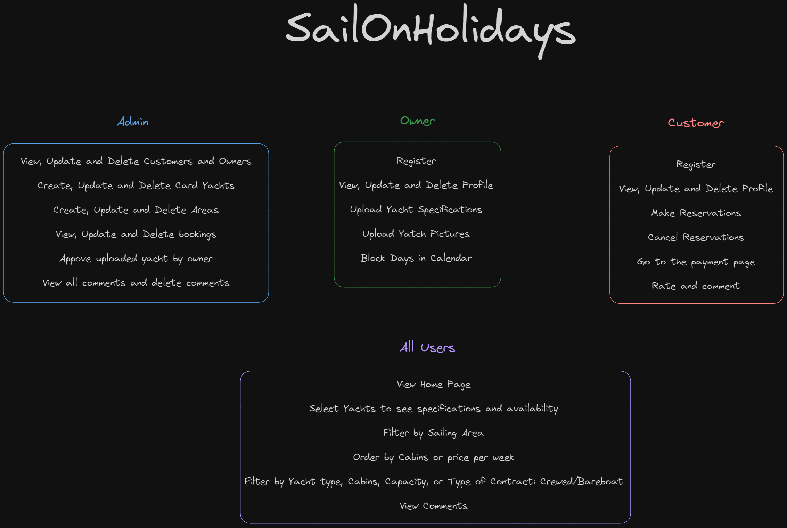
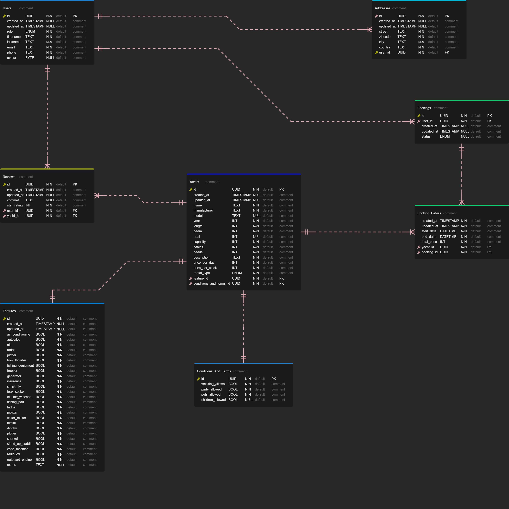

# Backend Project for Yacht Rental "SailOnHolidays"

Welcome to the backend project for boat rental! This project is built using ASP.NET Core, Entity Framework Core, and PostgreSQL, providing a robust foundation for managing boat rentals.

## Technologies Used

- **ASP.NET Core:** The backend is developed using ASP.NET Core, a cross-platform, high-performance framework for building modern, cloud-based, and internet-connected applications.

- **Entity Framework Core:** Leveraging Entity Framework Core for database access, this project simplifies interactions with the database by providing a strongly typed, data-centric API.

- **PostgreSQL:** The project utilizes PostgreSQL as the relational database management system, offering scalability, extensibility, and reliability for storing boat rental data.

## Project Structure

The backend is structured to efficiently handle boat rental operations, including user authentication, boat management, booking transactions, and more. The use of Entity Framework Core ensures a smooth interaction with the PostgreSQL database.

Feel free to explore the source code and adapt it to fit your specific boat rental application needs. If you have any questions or suggestions, please don't hesitate to reach out!

Happy coding! ⛵🌊

## Table of Contents

1. [Clean Architecture Overview](#clean-architecture-overview)
2. [Features](#features)
3. [Entity Relationship Diagram](#entity-relationship-diagram)
4. [Workflow example](#workflow-example)
5. [Implemented](#implemented)

## Clean Architecture Overview

This repository follows the principles of Clean Architecture, emphasizing separation of concerns and maintainability. The architecture includes the following layers:

- **Core:** Contains the core business logic and entities.
- **Business:** Implements the use cases and business rules.
- **Controller:** Handles HTTP requests and orchestrates interactions between the WebAPI and Business layers.
- **WebAPI:** Exposes the API endpoints to interact with the system.

## Features

## Entity Relationship Diagram

